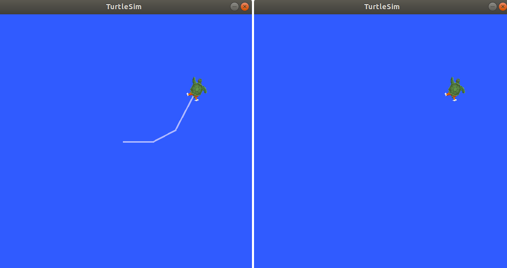

# Понимание сервисов в ROS 2

**Цель:** Изучить сервисы (services) в ROS 2 с помощью инструментов командной строки.

## Содержание
- [Введение](#введение)
- [Предварительные требования](#предварительные-требования)
- [Задачи](#задачи)
  1. [Настройка](#1-настройка)
  2. [ros2 service list](#2-ros2-service-list)
  3. [ros2 service type](#3-ros2-service-type)
  4. [ros2 service info](#4-ros2-service-info)
  5. [ros2 service find](#5-ros2-service-find)
  6. [ros2 interface show](#6-ros2-interface-show)
  7. [ros2 service call](#7-ros2-service-call)
  8. [ros2 service echo](#8-ros2-service-echo)
- [Резюме](#резюме)
- [Следующие шаги](#следующие-шаги)
- [Дополнительные материалы](#дополнительные-материалы)

## Введение

Сервисы — это ещё один способ коммуникации между узлами в графе ROS. Сервисы основаны на модели «запрос–ответ» (call-and-response) в отличие от модели издатель-подписчик (publisher-subscriber) для тем. В то время как темы позволяют узлам подписываться на потоки данных и получать постоянные обновления, сервисы предоставляют данные только тогда, когда они явно вызваны клиентом.


## Предварительные требования

Некоторые концепции, упомянутые в этом уроке, такие как узлы (nodes) и темы (topics), были рассмотрены в предыдущих уроках.

Вам потребуется пакет `turtlesim`.

Как всегда, не забывайте sourceить ROS 2 в каждом новом терминале:

```bash
source /opt/ros/<ваша_версия>/setup.bash
```

## Задачи

### 1. Настройка

Запустите два узла `turtlesim`: `/turtlesim` и `/teleop_turtle`.

Откройте новый терминал и выполните:

```bash
ros2 run turtlesim turtlesim_node
```

Откройте другой терминал и выполните:

```bash
ros2 run turtlesim turtle_teleop_key
```

### 2. ros2 service list

Выполнив команду `ros2 service list` в новом терминале, вы получите список всех активных в данный момент сервисов в системе:

```bash
ros2 service list
```

```
/clear
/kill
/reset
/spawn
/teleop_turtle/describe_parameters
/teleop_turtle/get_parameter_types
/teleop_turtle/get_parameters
/teleop_turtle/list_parameters
/teleop_turtle/set_parameters
/teleop_turtle/set_parameters_atomically
/turtle1/set_pen
/turtle1/teleport_absolute
/turtle1/teleport_relative
/turtlesim/describe_parameters
/turtlesim/get_parameter_types
/turtlesim/get_parameters
/turtlesim/list_parameters
/turtlesim/set_parameters
/turtlesim/set_parameters_atomically
```

Вы увидите, что оба узла имеют одни и те же шесть сервисов с параметрами в названиях. Почти каждый узел в ROS 2 имеет эти инфраструктурные сервисы, на которых построены параметры. Подробнее о параметрах будет рассказано в следующем уроке. В этом уроке мы не будем рассматривать сервисы, связанные с параметрами.

Сосредоточимся на специфических для `turtlesim` сервисах: `/clear`, `/kill`, `/reset`, `/spawn`, `/turtle1/set_pen`, `/turtle1/teleport_absolute` и `/turtle1/teleport_relative`. Возможно, вы помните, как взаимодействовали с некоторыми из этих сервисов с помощью `rqt` в уроке «Использование turtlesim, ros2 и rqt».

### 3. ros2 service type

Сервисы имеют типы, которые описывают структуру данных запроса и ответа. Типы сервисов определяются аналогично типам тем, но состоят из двух частей: одно сообщение для запроса и другое для ответа.

Чтобы узнать тип сервиса, используйте команду:

```bash
ros2 service type <имя_сервиса>
```

Рассмотрим сервис `/clear` из `turtlesim`. В новом терминале выполните:

```bash
ros2 service type /clear
```

```
std_srvs/srv/Empty
```

Тип `Empty` означает, что вызов сервиса не передаёт никаких данных при запросе и не получает данных в ответе.

#### 3.1 ros2 service list -t

Чтобы одновременно увидеть типы всех активных сервисов, можно добавить опцию `--show-types` (сокращённо `-t`) к команде `list`:

```bash
ros2 service list -t
```

```
/clear [std_srvs/srv/Empty]
/kill [turtlesim/srv/Kill]
/reset [std_srvs/srv/Empty]
/spawn [turtlesim/srv/Spawn]
...
/turtle1/set_pen [turtlesim/srv/SetPen]
/turtle1/teleport_absolute [turtlesim/srv/TeleportAbsolute]
/turtle1/teleport_relative [turtlesim/srv/TeleportRelative]
...
```

### 4. ros2 service info

Чтобы получить информацию о конкретном сервисе, используйте команду:

```bash
ros2 service info <имя_сервиса>
```

Она возвращает тип сервиса и количество клиентов и серверов данного сервиса.

Например, для сервиса `/clear`:

```bash
ros2 service info /clear
```

```
Type: std_srvs/srv/Empty
Clients count: 0
Services count: 1
```

### 5. ros2 service find

Если нужно найти все сервисы определённого типа, используйте команду:

```bash
ros2 service find <имя_типа>
```

Например, найдём все сервисы типа `Empty`:

```bash
ros2 service find std_srvs/srv/Empty
```

```
/clear
/reset
```

### 6. ros2 interface show

Вызывать сервисы из командной строки можно, но сначала нужно знать структуру аргументов ввода.

```bash
ros2 interface show <имя_типа>
```

Попробуем для типа `Empty` сервиса `/clear`:

```bash
ros2 interface show std_srvs/srv/Empty
```

```
---
```

Черта `---` разделяет структуру запроса (выше) и ответа (ниже). Но, как мы уже знаем, тип `Empty` не передаёт и не получает данных, поэтому его структура пуста.

Теперь изучим сервис с типом, который передаёт и получает данные, например `/spawn`. Из результатов `ros2 service list -t` мы знаем, что тип `/spawn` — `turtlesim/srv/Spawn`.

Чтобы увидеть аргументы запроса и ответа сервиса `/spawn`, выполните:

```bash
ros2 interface show turtlesim/srv/Spawn
```

```
float32 x
float32 y
float32 theta
string name # Optional.  A unique name will be created and returned if this is empty
---
string name
```

Информация выше линии `---` говорит нам, какие аргументы нужны для вызова `/spawn`: `x`, `y` и `theta` определяют позицию и ориентацию новой черепахи, а `name` является необязательным. Информация ниже линии показывает структуру ответа — в данном случае это только имя созданной черепахи.

### 7. ros2 service call

Теперь, когда мы знаем, как определить тип сервиса и структуру его аргументов, можно вызвать сервис с помощью команды:

```bash
ros2 service call <имя_сервиса> <тип_сервиса> <аргументы>
```

Часть `<аргументы>` необязательна. Например, сервисы типа `Empty` не имеют аргументов:

```bash
ros2 service call /clear std_srvs/srv/Empty
```

Эта команда очистит окно `turtlesim` от линий, нарисованных черепахой.



Теперь создадим новую черепаху, вызвав `/spawn` с аргументами. Аргументы в вызове сервиса из командной строки должны быть в формате YAML.

Выполните команду:

```bash
ros2 service call /spawn turtlesim/srv/Spawn "{x: 2, y: 2, theta: 0.2, name: ''}"
```

Вывод будет примерно таким:

```
requester: making request: turtlesim.srv.Spawn_Request(x=2.0, y=2.0, theta=0.2, name='')

response:
turtlesim.srv.Spawn_Response(name='turtle2')
```

В окне `turtlesim` сразу появится новая черепаха:


### 8. ros2 service echo

Чтобы увидеть обмен данными между клиентом и сервером сервиса, можно использовать эхо-режим:

```bash
ros2 service echo <имя_сервиса | тип_сервиса> <аргументы>
```

`ros2 service echo` зависит от возможности интроспекции сервиса, которая по умолчанию отключена. Чтобы её включить, необходимо вызвать `configure_introspection` после создания клиента или сервера сервиса.

Запустите демонстрационные узлы с поддержкой интроспекции:

```bash
ros2 launch demo_nodes_cpp introspect_services_launch.py
```

В другом терминале выполните следующие команды, чтобы включить интроспекцию для клиента и сервера:

```bash
ros2 param set /introspection_service service_configure_introspection contents
ros2 param set /introspection_client client_configure_introspection contents
```

Теперь можно наблюдать за коммуникацией сервиса `/add_two_ints` через `ros2 service echo`:

```bash
ros2 service echo --flow-style /add_two_ints
```

Пример вывода:

```
 info:
   event_type: REQUEST_SENT
   stamp:
     sec: 1709408301
     nanosec: 423227292
   client_gid: [1, 15, 0, 18, 250, 205, 12, 100, 0, 0, 0, 0, 0, 0, 21, 3]
   sequence_number: 618
 request: [{a: 2, b: 3}]
 response: []
 ---
 info:
   event_type: REQUEST_RECEIVED
   stamp:
     sec: 1709408301
     nanosec: 423601471
   client_gid: [1, 15, 0, 18, 250, 205, 12, 100, 0, 0, 0, 0, 0, 0, 20, 4]
   sequence_number: 618
 request: [{a: 2, b: 3}]
 response: []
 ---
 info:
   event_type: RESPONSE_SENT
   stamp:
     sec: 1709408301
     nanosec: 423900744
   client_gid: [1, 15, 0, 18, 250, 205, 12, 100, 0, 0, 0, 0, 0, 0, 20, 4]
   sequence_number: 618
 request: []
 response: [{sum: 5}]
 ---
 info:
   event_type: RESPONSE_RECEIVED
   stamp:
     sec: 1709408301
     nanosec: 424153133
   client_gid: [1, 15, 0, 18, 250, 205, 12, 100, 0, 0, 0, 0, 0, 0, 21, 3]
   sequence_number: 618
 request: []
 response: [{sum: 5}]
 ---
```

## Резюме

Узлы могут обмениваться данными с помощью сервисов в ROS 2. В отличие от тем — однонаправленного потока, где узел публикует информацию, потребляемую одним или несколькими подписчиками, — сервис представляет собой шаблон «запрос/ответ»: клиент отправляет запрос узлу, предоставляющему сервис, а сервис обрабатывает запрос и формирует ответ.

Обычно не рекомендуется использовать сервисы для непрерывных вызовов; для этого лучше подходят темы или действия.

В этом уроке вы использовали инструменты командной строки для идентификации, изучения и вызова сервисов.

## Следующие шаги

В следующем уроке «Понимание параметров» вы узнаете о настройке параметров узлов.

## Дополнительные материалы

Ознакомьтесь с этим уроком; это отличный реальный пример применения сервисов ROS с использованием робота Robotis.