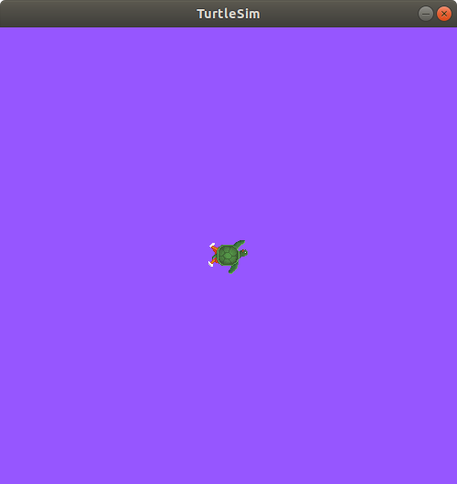

# Понимание параметров в ROS 2

**Цель:** Научиться получать, устанавливать, сохранять и перезагружать параметры в ROS 2.

## Содержание
- [Введение](#введение)
- [Предварительные требования](#предварительные-требования)
- [Задачи](#задачи)
  1. [Настройка](#1-настройка)
  2. [ros2 param list](#2-ros2-param-list)
  3. [ros2 param get](#3-ros2-param-get)
  4. [ros2 param set](#4-ros2-param-set)
  5. [ros2 param dump](#5-ros2-param-dump)
  6. [ros2 param load](#6-ros2-param-load)
  7. [Загрузка файла параметров при запуске узла](#7-загрузка-файла-параметров-при-запуске-узла)
- [Резюме](#резюме)
- [Следующие шаги](#следующие-шаги)
- [Дополнительные материалы](#дополнительные-материалы)

## Введение

Параметр — это конфигурационное значение узла (node). Можно представить параметры как настройки узла. Узел может хранить параметры в виде целых чисел, чисел с плавающей запятой, логических значений, строк и списков. В ROS 2 каждый узел поддерживает собственные параметры. Дополнительную информацию о параметрах можно найти в [концептуальном документе](https://docs.ros.org/en/rolling/Concepts/About-ROS-2-Parameters.html) (на английском).

## Предварительные требования

Этот урок использует пакет `turtlesim`.

Как всегда, не забывайте sourceить ROS 2 в каждом новом терминале:

```bash
source /opt/ros/<ваша_версия>/setup.bash
```

## Задачи

### 1. Настройка

Запустите два узла `turtlesim`: `/turtlesim` и `/teleop_turtle`.

Откройте новый терминал и выполните:

```bash
ros2 run turtlesim turtlesim_node
```

Откройте другой терминал и выполните:

```bash
ros2 run turtlesim turtle_teleop_key
```

### 2. ros2 param list

Чтобы увидеть параметры, принадлежащие вашим узлам, откройте новый терминал и выполните команду:

```bash
ros2 param list
```

Вы увидите примерно такой вывод:

```
/teleop_turtle:
  qos_overrides./parameter_events.publisher.depth
  qos_overrides./parameter_events.publisher.durability
  qos_overrides./parameter_events.publisher.history
  qos_overrides./parameter_events.publisher.reliability
  scale_angular
  scale_linear
  use_sim_time
/turtlesim:
  background_b
  background_g
  background_r
  qos_overrides./parameter_events.publisher.depth
  qos_overrides./parameter_events.publisher.durability
  qos_overrides./parameter_events.publisher.history
  qos_overrides./parameter_events.publisher.reliability
  use_sim_time
```

Вы видите пространства имён узлов: `/teleop_turtle` и `/turtlesim`, а затем параметры каждого узла.

У каждого узла есть параметр `use_sim_time`; он не уникален для `turtlesim`.

Судя по названиям, параметры `/turtlesim` определяют цвет фона окна `turtlesim` с использованием значений RGB.

Чтобы определить тип параметра, можно воспользоваться командой `ros2 param get`.

### 3. ros2 param get

Для отображения типа и текущего значения параметра используйте команду:

```bash
ros2 param get <имя_узла> <имя_параметра>
```

Узнаем текущее значение параметра `background_g` узла `/turtlesim`:

```bash
ros2 param get /turtlesim background_g
```

```
Integer value is: 86
```

Теперь вы знаете, что `background_g` хранит целочисленное значение.

Если выполнить ту же команду для `background_r` и `background_b`, вы получите значения 69 и 255 соответственно.

### 4. ros2 param set

Чтобы изменить значение параметра во время выполнения, используйте команду:

```bash
ros2 param set <имя_узла> <имя_параметра> <значение>
```

Изменим цвет фона `/turtlesim`:

```bash
ros2 param set /turtlesim background_r 150
```

```
Set parameter successful
```

Фон окна `turtlesim` должен изменить цвет:



Установка параметров с помощью команды `set` изменяет их только в текущем сеансе, но не постоянно. Однако вы можете сохранить настройки и загрузить их при следующем запуске узла.

### 5. ros2 param dump

Вы можете просмотреть все текущие значения параметров узла с помощью команды:

```bash
ros2 param dump <имя_узла>
```

По умолчанию команда выводит результат в стандартный вывод (stdout), но вы можете перенаправить значения параметров в файл, чтобы сохранить их на будущее. Чтобы сохранить текущую конфигурацию параметров `/turtlesim` в файл `turtlesim.yaml`, выполните:

```bash
ros2 param dump /turtlesim > turtlesim.yaml
```

В текущей рабочей директории появится новый файл. Если вы откроете его, то увидите следующее содержимое:

```yaml
/turtlesim:
  ros__parameters:
    background_b: 255
    background_g: 86
    background_r: 150
    qos_overrides:
      /parameter_events:
        publisher:
          depth: 1000
          durability: volatile
          history: keep_last
          reliability: reliable
    use_sim_time: false
```

Сохранение параметров пригодится, если вы захотите в будущем перезапустить узел с теми же настройками.

### 6. ros2 param load

Вы можете загрузить параметры из файла в уже запущенный узел с помощью команды:

```bash
ros2 param load <имя_узла> <файл_параметров>
```

Чтобы загрузить файл `turtlesim.yaml`, созданный командой `ros2 param dump`, в узел `/turtlesim`, выполните:

```bash
ros2 param load /turtlesim turtlesim.yaml
```

```
Set parameter background_b successful
Set parameter background_g successful
Set parameter background_r successful
Set parameter qos_overrides./parameter_events.publisher.depth failed: parameter 'qos_overrides./parameter_events.publisher.depth' cannot be set because it is read-only
Set parameter qos_overrides./parameter_events.publisher.durability failed: parameter 'qos_overrides./parameter_events.publisher.durability' cannot be set because it is read-only
Set parameter qos_overrides./parameter_events.publisher.history failed: parameter 'qos_overrides./parameter_events.publisher.history' cannot be set because it is read-only
Set parameter qos_overrides./parameter_events.publisher.reliability failed: parameter 'qos_overrides./parameter_events.publisher.reliability' cannot be set because it is read-only
Set parameter use_sim_time successful
```

> **Примечание:** Параметры, доступные только для чтения (read-only), могут быть изменены только при запуске узла, но не во время его работы. Поэтому возникают предупреждения для параметров «qos_overrides».

### 7. Загрузка файла параметров при запуске узла

Чтобы запустить узел с сохранёнными значениями параметров, используйте:

```bash
ros2 run <имя_пакета> <имя_исполняемого_файла> --ros-args --params-file <имя_файла>
```

Это та же команда, которую вы обычно используете для запуска `turtlesim`, но с добавленными флагами `--ros-args` и `--params-file`, за которыми следует имя файла с параметрами.

Остановите работающий узел `turtlesim` и попробуйте перезапустить его с сохранёнными параметрами:

```bash
ros2 run turtlesim turtlesim_node --ros-args --params-file turtlesim.yaml
```

Окно `turtlesim` должно появиться как обычно, но с фиолетовым фоном, который вы установили ранее.

> **Примечание:** При использовании файла параметров при запуске узла обновляются все параметры, включая те, что доступны только для чтения.

## Резюме

Узлы имеют параметры для определения значений конфигурации по умолчанию. Вы можете получать и устанавливать значения параметров из командной строки. Также можно сохранять настройки параметров в файл, чтобы загрузить их в будущем сеансе.

## Следующие шаги

Теперь вы изучили все основные концепции ROS 2. Следующий урок познакомит вас с инструментами и методами, упрощающими использование ROS 2, начиная с **Использования rqt_console для просмотра логов**.

## Дополнительные материалы

* Официальная документация ROS 2: [Understanding parameters](https://docs.ros.org/en/rolling/Tutorials/Beginner-CLI-Tools/Understanding-ROS2-Parameters/Understanding-ROS2-Parameters.html) (на английском)