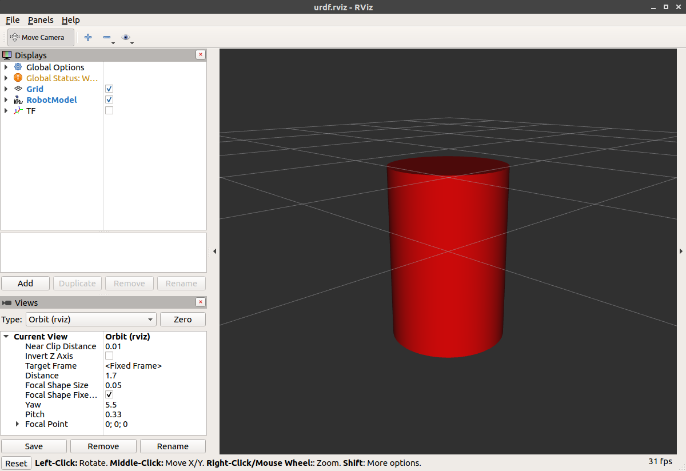
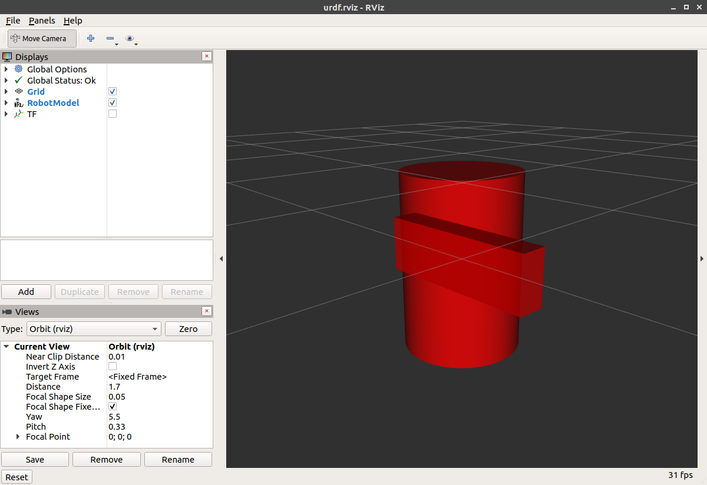
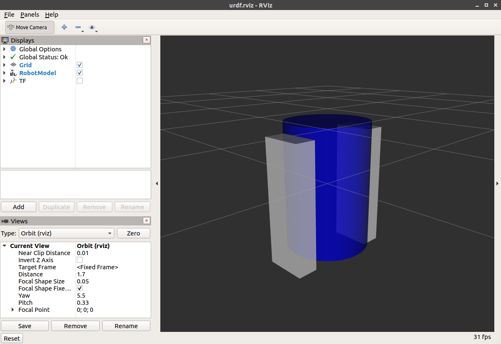
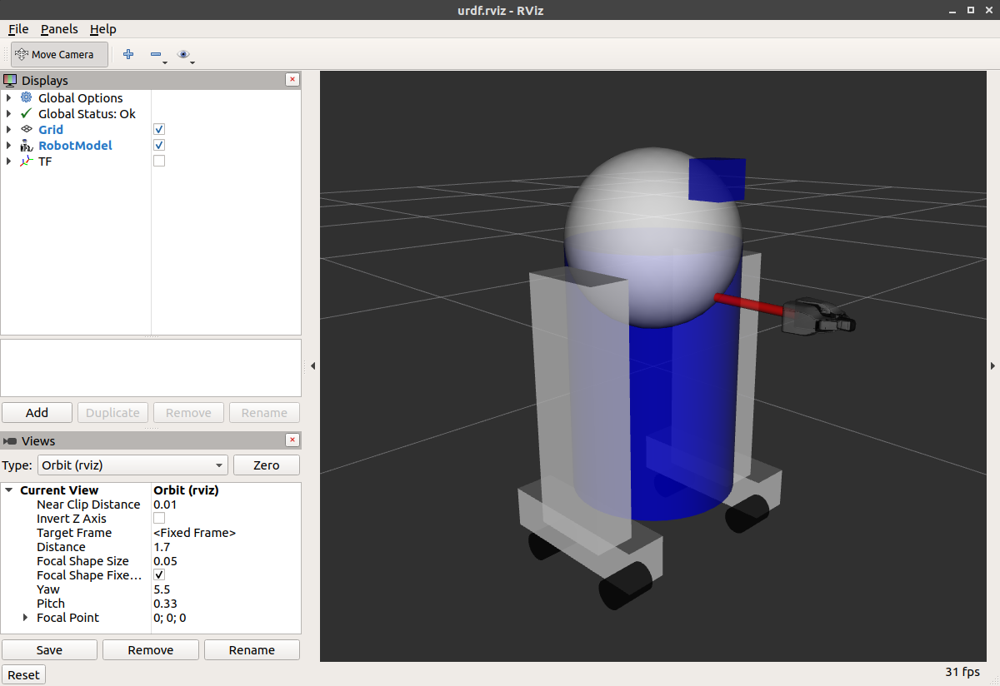

# Создание визуальной модели робота вручную (туториал по URDF)

**Цель:** Научиться создавать визуальную модель робота, которую можно просматривать в RViz.

## Содержание
1. [Введение](#введение)
2. [Одна форма](#одна-форма)
3. [Несколько форм](#несколько-форм)
4. [Начала координат](#начала-координат)
5. [Материалы](#материалы)
6. [Завершение модели](#завершение-модели)

---

## Введение

В этом туториале мы построим визуальную модель робота, отдалённо напоминающего R2D2. В следующих уроках вы научитесь делать модель подвижной, добавлять физические свойства и упрощать код с помощью xacro. Сейчас же мы сосредоточимся на правильном задании визуальной геометрии.

> **Примечание:** Предполагается, что вы умеете писать правильно оформленный XML-код.

Перед началом убедитесь, что у вас установлен пакет `joint_state_publisher`. Если вы устанавливали бинарные файлы `urdf_tutorial`, он должен быть уже установлен. В противном случае обновите установку (используйте `rosdep` для проверки).

Все модели, упомянутые в этом руководстве (и исходные файлы), можно найти в пакете `urdf_tutorial`.

---

## Одна форма

Начнём с простейшей формы. Вот минимальный URDF-файл, который можно создать ([исходник: 01-myfirst.urdf](https://github.com/ros/urdf_tutorial/blob/master/urdf/01-myfirst.urdf)):

```xml
<?xml version="1.0"?>
<robot name="myfirst">
  <link name="base_link">
    <visual>
      <geometry>
        <cylinder length="0.6" radius="0.2"/>
      </geometry>
    </visual>
  </link>
</robot>
```

Если перевести XML на человеческий язык: это робот с именем `myfirst`, содержащий одно звено (часть) с именем `base_link`, визуальный компонент которого представляет собой просто цилиндр длиной 0.6 метра и радиусом 0.2 метра. Может показаться, что для простейшего примера слишком много вложенных тегов, но поверьте, дальше будет сложнее.

Чтобы просмотреть модель, запустите файл `display.launch.py`:

```bash
ros2 launch urdf_tutorial display.launch.py model:=urdf/01-myfirst.urdf
```

Этот запуск делает три вещи:
- Загружает указанную модель и сохраняет её как параметр для узла `robot_state_publisher`.
- Запускает узлы для публикации `sensor_msgs/msg/JointState` и трансформаций (подробнее позже).
- Запускает RViz с предварительно настроенной конфигурацией.

После запуска вы увидите в RViz следующее:



**Важные моменты:**
- Фиксированная система координат (`Fixed Frame`) — это та система, в которой находится центр сетки. Здесь это фрейм, заданный нашим единственным звеном `base_link`.
- Визуальный элемент (цилиндр) по умолчанию имеет начало координат в центре своей геометрии. Поэтому половина цилиндра находится ниже сетки.

---

## Несколько форм

Теперь добавим несколько форм/звеньев. Если просто добавить ещё один элемент `<link>`, парсер не будет знать, где его разместить. Для этого используются сочленения (`joint`). Сочленения могут описывать как подвижные, так и неподвижные соединения. Начнём с неподвижных (`fixed`). ([исходник: 02-multipleshapes.urdf](https://github.com/ros/urdf_tutorial/blob/master/urdf/02-multipleshapes.urdf))

```xml
<?xml version="1.0"?>
<robot name="multipleshapes">
  <link name="base_link">
    <visual>
      <geometry>
        <cylinder length="0.6" radius="0.2"/>
      </geometry>
    </visual>
  </link>

  <link name="right_leg">
    <visual>
      <geometry>
        <box size="0.6 0.1 0.2"/>
      </geometry>
    </visual>
  </link>

  <joint name="base_to_right_leg" type="fixed">
    <parent link="base_link"/>
    <child link="right_leg"/>
  </joint>

</robot>
```

- Мы добавили коробку размерами 0.6×0.1×0.2 метра.
- Сочленение определено через родительское и дочернее звенья. URDF — это древовидная структура с одним корневым звеном. Здесь положение ноги зависит от положения `base_link`.

Запустим:

```bash
ros2 launch urdf_tutorial display.launch.py model:=urdf/02-multipleshapes.urdf
```



Обе фигуры перекрываются, потому что у них общее начало координат. Чтобы развести их, нужно задать разные начала координат.

---

## Начала координат

Нога R2D2 крепится к верхней половине корпуса сбоку. Поэтому мы зададим начало сочленения (`joint`) именно там. Кроме того, нога крепится не посередине, а верхней частью, поэтому нужно сместить начало координат и для самой ноги. Также мы повернём ногу, чтобы она стояла вертикально. ([исходник: 03-origins.urdf](https://github.com/ros/urdf_tutorial/blob/master/urdf/03-origins.urdf))

```xml
<?xml version="1.0"?>
<robot name="origins">
  <link name="base_link">
    <visual>
      <geometry>
        <cylinder length="0.6" radius="0.2"/>
      </geometry>
    </visual>
  </link>

  <link name="right_leg">
    <visual>
      <geometry>
        <box size="0.6 0.1 0.2"/>
      </geometry>
      <origin rpy="0 1.57075 0" xyz="0 0 -0.3"/>
    </visual>
  </link>

  <joint name="base_to_right_leg" type="fixed">
    <parent link="base_link"/>
    <child link="right_leg"/>
    <origin xyz="0 -0.22 0.25"/>
  </joint>

</robot>
```

Разберём:

- **Сочленение:** его начало задаётся относительно родительского звена (`base_link`). Мы смещаемся на -0.22 м по оси Y (влево от нас, но вправо относительно осей координат) и на 0.25 м по оси Z (вверх). Это означает, что начало координат дочернего звена будет выше и правее. Поскольку мы не указали `rpy` (roll, pitch, yaw), ориентация дочернего фрейма совпадает с родительским.

- **Визуальный элемент ноги:** у него есть своё смещение `xyz` и поворот `rpy`. Это определяет, где должен находиться центр визуальной геометрии относительно фрейма звена. Чтобы нога крепилась верхней частью, мы смещаем её вниз на 0.3 м по Z (`xyz="0 0 -0.3"`). А чтобы длинная часть ноги была параллельна оси Z, поворачиваем визуальный элемент на π/2 вокруг оси Y (`rpy="0 1.57075 0"`).

Запустим:

```bash
ros2 launch urdf_tutorial display.launch.py model:=urdf/03-origins.urdf
```


Запускаемый файл запускает пакеты, которые создают фреймы TF для каждого звена на основе URDF. RViz использует эту информацию, чтобы понять, где отображать каждую фигуру.

> Если для звена не существует фрейма TF, оно будет помещено в начало координат и отображаться белым цветом.

---

## Материалы

«Хорошо, — скажете вы. — Это всё мило, но не у всех же есть B21. Мой робот и R2D2 не красные!» Это справедливое замечание. Давайте разберём тег `<material>`. ([исходник: 04-materials.urdf](https://github.com/ros/urdf_tutorial/blob/master/urdf/04-materials.urdf))

```xml
<?xml version="1.0"?>
<robot name="materials">

  <material name="blue">
    <color rgba="0 0 0.8 1"/>
  </material>

  <material name="white">
    <color rgba="1 1 1 1"/>
  </material>

  <link name="base_link">
    <visual>
      <geometry>
        <cylinder length="0.6" radius="0.2"/>
      </geometry>
      <material name="blue"/>
    </visual>
  </link>

  <link name="right_leg">
    <visual>
      <geometry>
        <box size="0.6 0.1 0.2"/>
      </geometry>
      <origin rpy="0 1.57075 0" xyz="0 0 -0.3"/>
      <material name="white"/>
    </visual>
  </link>

  <joint name="base_to_right_leg" type="fixed">
    <parent link="base_link"/>
    <child link="right_leg"/>
    <origin xyz="0 -0.22 0.25"/>
  </joint>

  <link name="left_leg">
    <visual>
      <geometry>
        <box size="0.6 0.1 0.2"/>
      </geometry>
      <origin rpy="0 1.57075 0" xyz="0 0 -0.3"/>
      <material name="white"/>
    </visual>
  </link>

  <joint name="base_to_left_leg" type="fixed">
    <parent link="base_link"/>
    <child link="left_leg"/>
    <origin xyz="0 0.22 0.25"/>
  </joint>

</robot>
```

- Корпус теперь синий. Мы определили новый материал с именем `blue`, задав каналы красного, зелёного, синего и альфа (прозрачности) как 0, 0, 0.8 и 1 соответственно. Все значения могут быть в диапазоне [0,1]. Этот материал затем используется в визуальном элементе `base_link`.
- Материал `white` определён аналогично.

Можно также определить материал прямо внутри визуального элемента и даже ссылаться на него в других звеньях. Никто не будет против, если вы переопределите его.

Кроме того, можно использовать текстуру — указать файл изображения для раскраски объекта.

Запустим:

```bash
ros2 launch urdf_tutorial display.launch.py model:=urdf/04-materials.urdf
```



---

## Завершение модели

Теперь добавим оставшиеся детали: ступни, колёса и голову. Наиболее примечательно — мы добавим сферу и несколько сеток (meshes). Также добавим несколько других элементов, которые пригодятся в будущем. ([исходник: 05-visual.urdf](https://github.com/ros/urdf_tutorial/blob/master/urdf/05-visual.urdf))

Приведём ключевые фрагменты. Полный файл довольно большой, но основные новые элементы:

- **Сфера для головы:**

```xml
<link name="head">
  <visual>
    <geometry>
      <sphere radius="0.2"/>
    </geometry>
    <material name="white"/>
  </visual>
</link>
```

- **Использование сеток (mesh):** здесь мы заимствуем сетки из PR2. Это отдельные файлы, путь к которым нужно указать. Следует использовать запись `package://ИМЯ_ПАКЕТА/путь/к/файлу`. В нашем случае сетки находятся в пакете `urdf_tutorial` в папке `meshes`.

```xml
<link name="left_gripper">
  <visual>
    <origin rpy="0.0 0 0" xyz="0 0 0"/>
    <geometry>
      <mesh filename="package://urdf_tutorial/meshes/l_finger.dae"/>
    </geometry>
  </visual>
</link>
```

Сетки могут быть импортированы в разных форматах. STL довольно распространён, но движок также поддерживает DAE, который может содержать собственную информацию о цвете, поэтому цвет/материал можно не указывать. Часто такие файлы ссылаются на текстуры (например, `.tif`), которые лежат в той же папке `meshes`.

Сетки также можно масштабировать с помощью относительных параметров или задавать размер ограничивающего параллелепипеда.

Можно ссылаться на сетки из совершенно другого пакета.

Запустим финальную модель:

```bash
ros2 launch urdf_tutorial display.launch.py model:=urdf/05-visual.urdf
```



Теперь у нас есть полноценная визуальная модель R2D2-подобного робота. В следующем туториале мы добавим подвижность и физические свойства.

---

**Примечание:** Все примеры взяты из официальной документации ROS2 и адаптированы для русскоязычных читателей. Оригинал статьи доступен [здесь](https://docs.ros.org/en/rolling/Tutorials/Intermediate/URDF/URDF-Main.html).